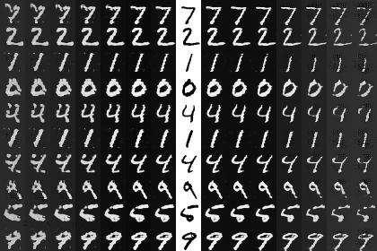
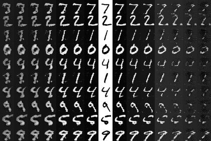
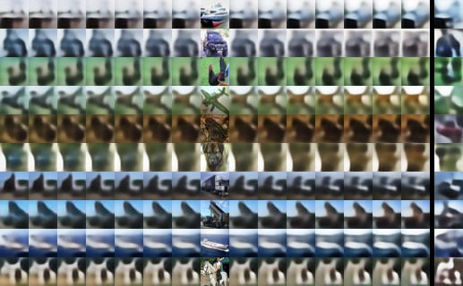
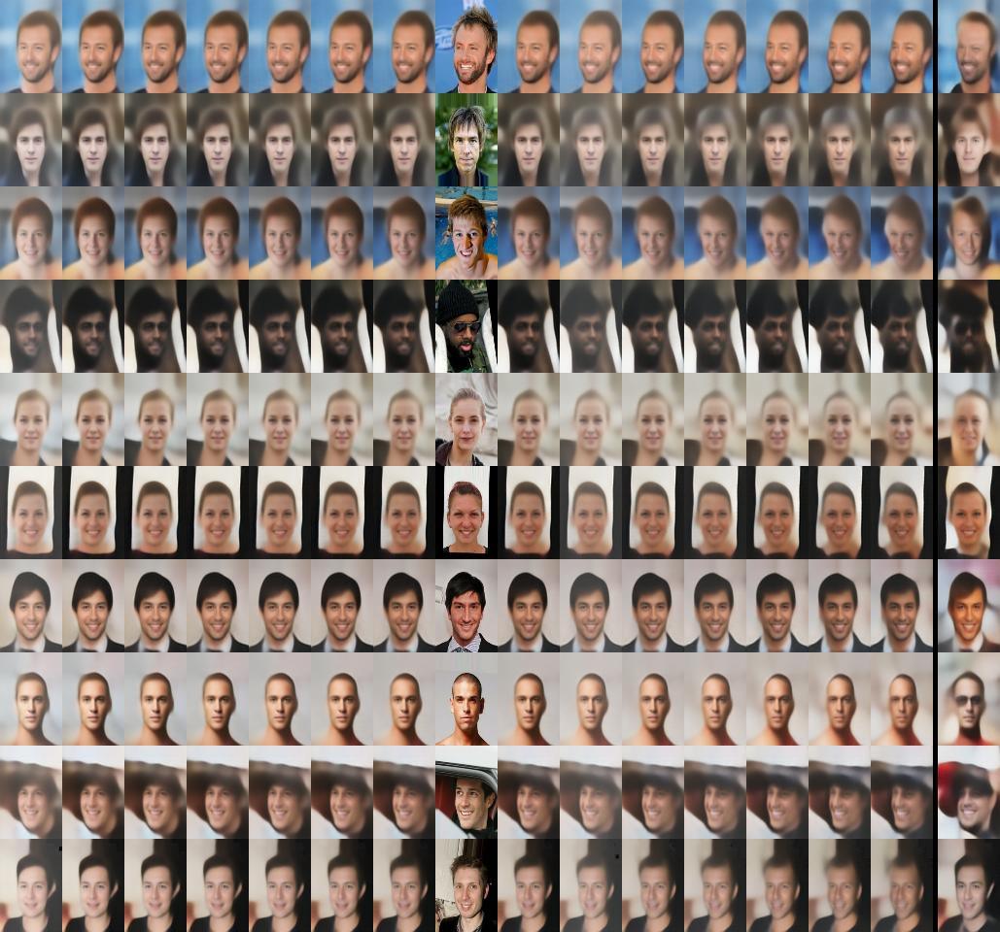
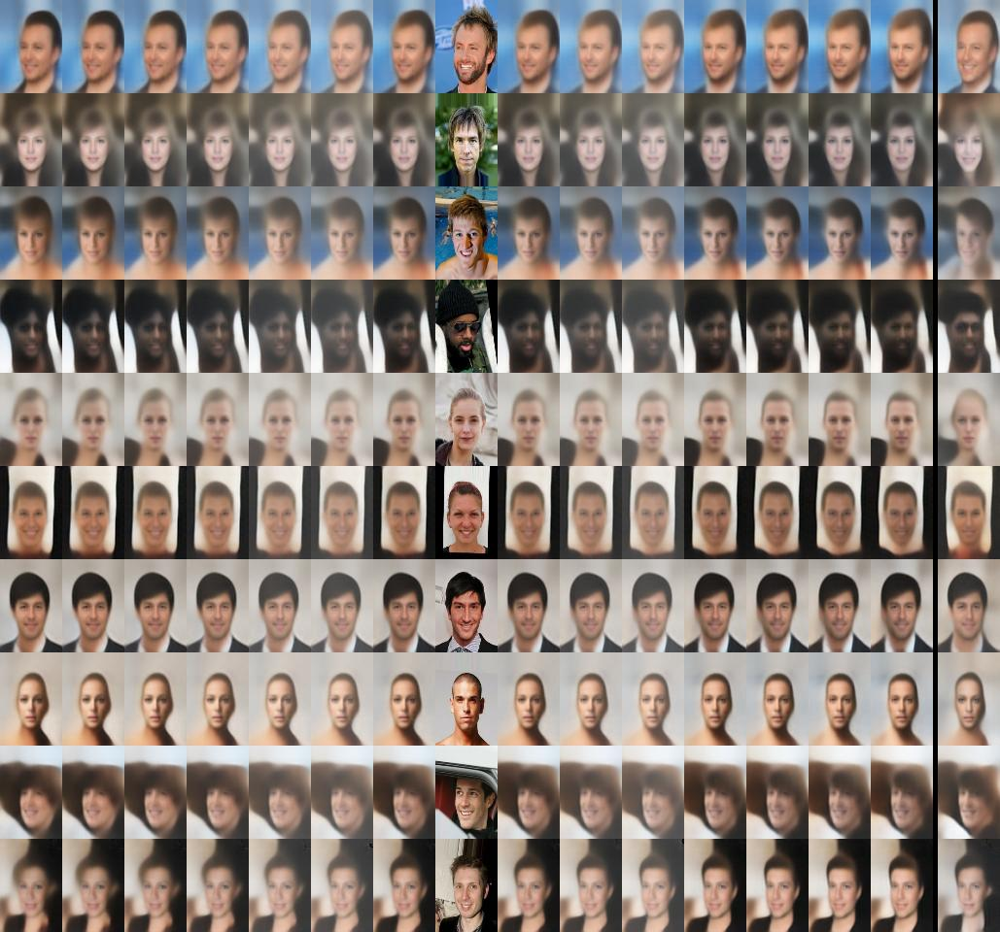
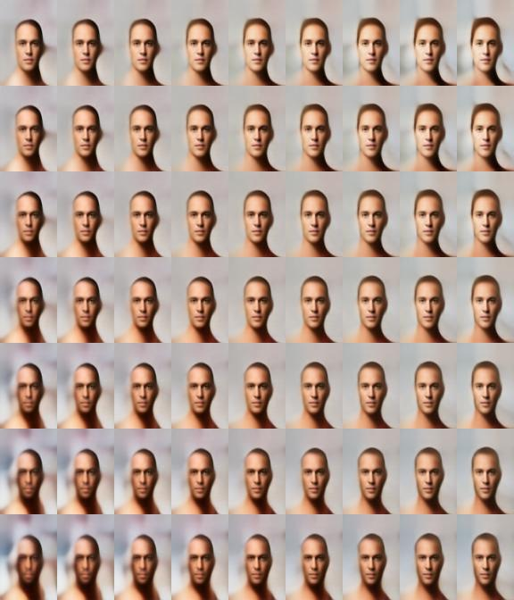
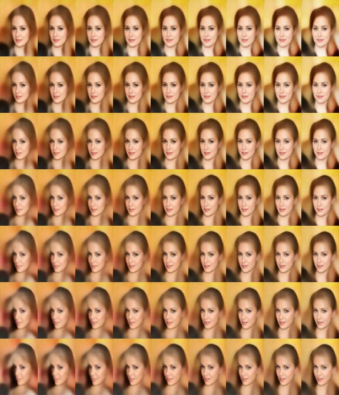
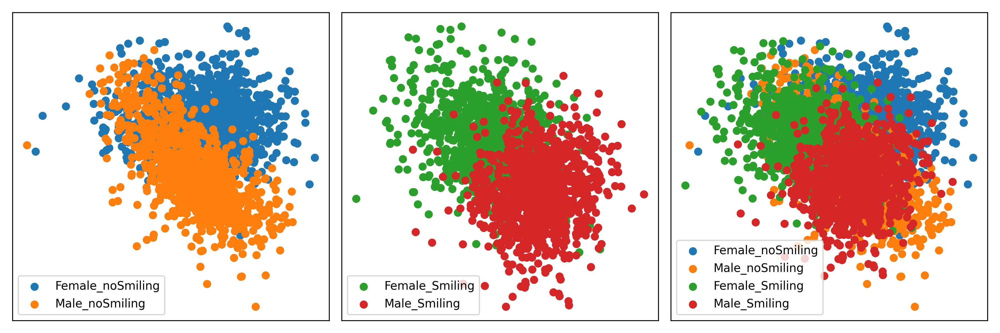

# G-VAE (Generative VAE)

概述：传统VAE只能用于重建，现在将其中中加入分类模型，并利用[ISDA Loss](https://zhuanlan.zhihu.com/p/344953635?utm_id=0)作为损失函数，能够有效地在同种类别上进行数据增强。

编解码选用的均为ResBlock框架，解码部分使用的是转置卷积作为上采样（和编码部分中卷积作为下采样相对应）。

## 效果演示

中间列为原图，左右列分别为按照两个方向的增强结果，步长为 0.5sigma）

**MNIST**（左G-VAE，右VAE）

    
    

**cifar10**（左G-VAE，右VAE，最右列为加入Gauss噪声后的增强结果）

    
    

**celeba**（左G-VAE，右VAE，最右列为加入Gauss噪声后的增强结果）

    
    

对中心的一张图片进行不同特征方向上的变换得到的结果：

    
    

使用PCA将图像特征降为到2维后的结果：

## 代码框架

解释每个代码的具体功能：

1. [`g_vae.py`](/katacv/G_VAE/g_vae.py), [`vae.py`](/katacv/G_VAE/vae.py)：分别为G-VAE和VAE的训练代码，包含参数解析、日志管理、创建模型、加载权重、权重管理、数据集读入、模型训练。
2. [`model.py`](/katacv/G_VAE/model.py)：模型定义和创建，其中包括 `Encoder`, `Decodr`, `VAE`, `G_VAE` 类，且具有初始化模型参数的函数。
3. [`isda_loss.py`](/katacv/G_VAE/isda_loss.py)：设计ISDA损失函数。
4. [`g_vae_predict.py`](/katacv/G_VAE/g_vae_predict.py), [`vae_predict.py`](/katacv/G_VAE/vae_predict.py)：分别为G-VAE和VAE对数据集进行预测的代码，预测功能包含：对当前数据按照其方差的方向进行正反向增强，从一张图片渐变到另一张图片等。（当前只需简单修改 `g_vae_predict.py` 即可分别对VAE和G-VAE进行预测）
5. [`logs.py`](/katacv/G_VAE/logs.py)：实例化训练日志记录的对象。
6. [`parser.py`](/katacv/G_VAE/parser.py)：解析训练模型所需的所有超参数。
7. [`constant_mnist.py`](/katacv/G_VAE/constant_mnist.py), [`constant_cifar10.py`](/katacv/G_VAE/constant_cifar10.py), [`constant_celeba.py`](/katacv/G_VAE/constant_celeba.py)：分别为MNIST、cifar10和celeba训练所需的全部超参数。
8. [`katacv/utils/mini_data/build_dataset.py`](/katacv/utils/mini_data/build_dataset.py)：包含构建数据集的 `DatasetBuilder` 类，用于创建 `tf.data.Dataset` 数据集，用于模型训练及预测。
9. （尝试后放用）[`model_unet.py`](/katacv/G_VAE/model_unet.py), [`constant_celeba_unet.py`](/katacv/G_VAE/constant_celeba_unet.py)：尝试将网络改成UNet后，发现生成的图像不再依赖低维特征表示，而是依赖下采样中的图像特征，导致泛化性大大下降，故弃用。
10. [`celeba_augmentation.ipynb`](/jupyter_interact/G-VAE/celeba_augmentation.ipynb)：使用Jupyter完成，用于沿不同方向渐变的图像生成，和PCA降维图像绘制。

